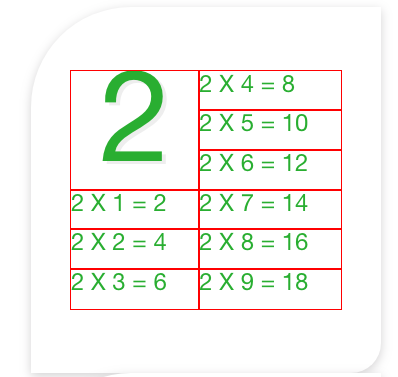
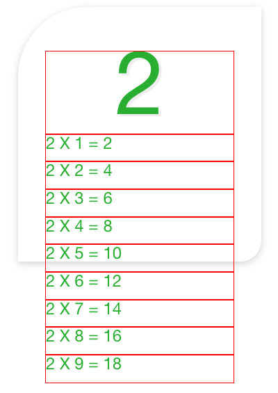
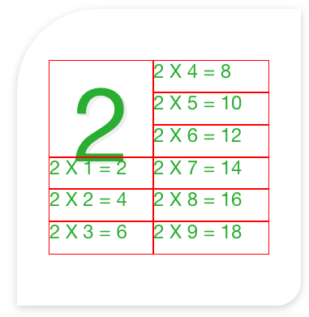
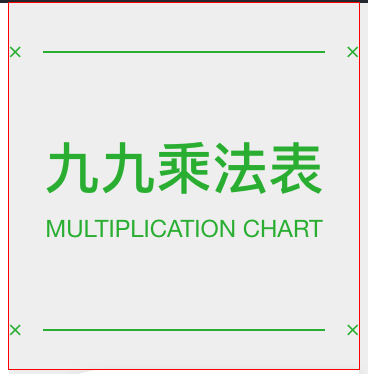
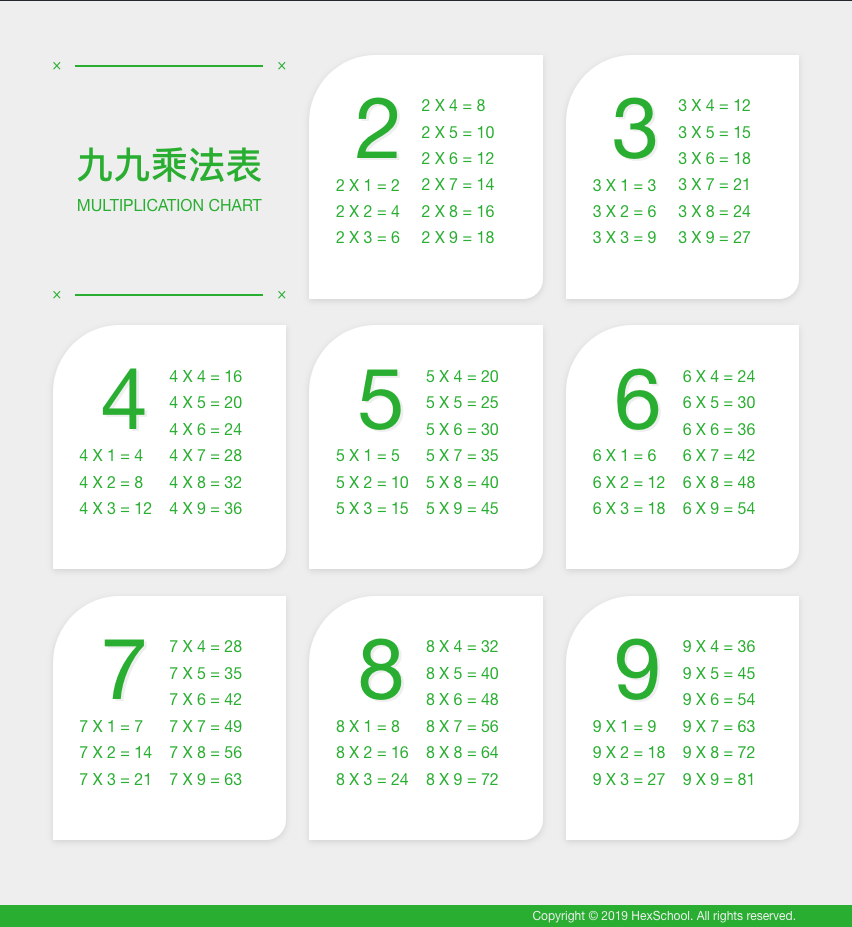
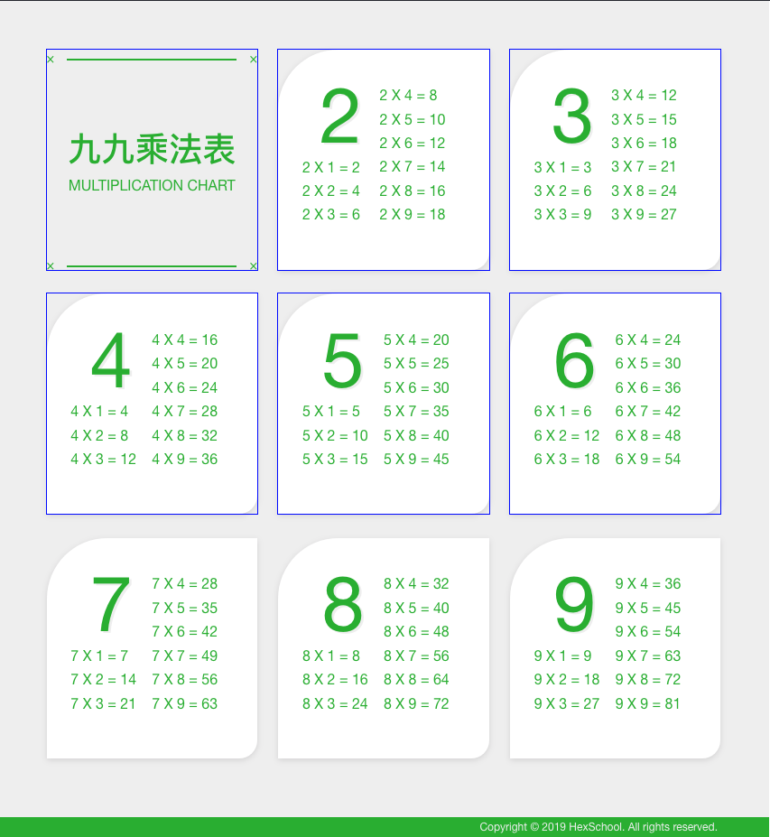
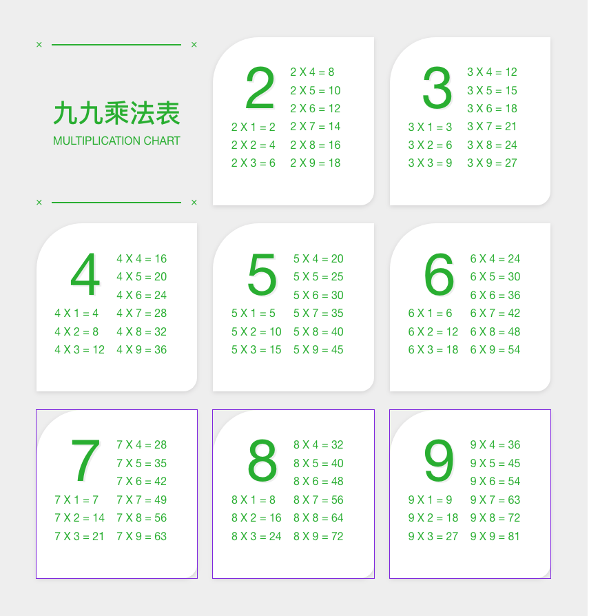

# 1F-9x9乘法表

20191003

[UI設計稿](https://xd.adobe.com/spec/256981fc-ef65-4d9b-773c-45d8ef0353c6-5358/screen/50fba855-bde7-4771-b73c-3fd839418cf0/multiplication-chart/)

---

## #九九乘法的排版

看了一下UI的部分，2x1和2x7是對齊的，大字的2和右邊的2x4也是對齊的    
我排起來的效果如下    
   


我是用flex去達到排成兩欄。    
這是還沒有加flex的時候    
   

```html
<div class="multiplication-card">
  <div class="multiplication-card__title">2</div>
  <div class="multiplication-card__formula">2 X 1 = 2</div>
  <div class="multiplication-card__formula">2 X 2 = 4</div>
  <div class="multiplication-card__formula">2 X 3 = 6</div>
  <div class="multiplication-card__formula">2 X 4 = 8</div>
  <div class="multiplication-card__formula">2 X 5 = 10</div>
  <div class="multiplication-card__formula">2 X 6 = 12</div>
  <div class="multiplication-card__formula">2 X 7 = 14</div>
  <div class="multiplication-card__formula">2 X 8 = 16</div>
  <div class="multiplication-card__formula">2 X 9 = 18</div>
</div>
```

加了flex之後就可以排成兩欄
```css
.multiplication-card {
  display: flex;
  flex-direction: column;
  flex-wrap: wrap;
}
```

再來要處理的大字和算式的高度    
大字是算50%，算式是想要在100%裡面塞六個，所以是calc(100% / 6);    
這樣看起來會像這樣    
  

```scss
.multiplication-card {
  &__title {
    font-size: 128px;
    height: 50%;
    text-shadow: 4px 3px 0px $color1;
  }
  &__formula {
    font-size: 24px;
    line-height: 1;
    text-align: left;
    height: calc(100% / 6);
  }
}

```

可以看到大字的部分有一點跑版，這裡我試出兩個方法
1. flex

```scss
.multiplication-card {
  &__title {
    ...
    display: flex;
    align-items: flex-end;
    justify-content: center;
  }
}
```

2. line-height    

```scss
.multiplication-card {
  &__title {
    ...
    line-height: 90px;
  }
}
```

## #九九乘法的標題
排起來如下：    
 

上下的裝飾線我是用before after來做

```html
<div class="multiplication-title__deco-line">
  <span></span>
</div>
```

```scss
  &__deco-line {
    > span {
      display: inline-block;
      font-family: "Helvetica Neue";
      width: 280px;
      border: 1px solid $color4;
      position: relative;
      &::before {
        content: "×";
        text-align: center;
        position: absolute;
        font-size: 24px;
        top: -17px;
        left: -36px;
      }
      &::after {
        content: "×";
        text-align: center;
        position: absolute;
        font-size: 24px;
        top: -17px;
        right: -36px;
      }
    }   
  }
```

九九乘法表的文字設計稿是標`font: Medium 56px/84px PingFang TC;`    
查了一下[文件](https://developer.mozilla.org/en-US/docs/Web/CSS/font-weight)，Medium是`font-weight: 500;`的意思    


## #整體的版面

這是我排完的結果    
   

花比較多時間處理的是7,8,9是最後一行，沒有margin空隙    
因為九九乘法表只有九格，所以可以直接寫好第七個以前才有margin    
```scss
  &__items {
    padding: 80px;
    box-sizing: border-box;
    background-color: $color1;
    display: flex;
    flex-wrap: wrap;
    justify-content: space-between;

    /* 方法一 第七個以前都加上margin-bottom */
    // 第七個以前都加上margin-bottom
    &__item:not(:nth-of-type(n+7)) {
      margin-bottom: 40px;
    }
  }
```
   

不過我在HTML5與CSS3響應式網頁設計這本書裡面(p.124)是看過自動算出最後一行的方法    
這裡就來練習一下

 

```scss
    &__item {
      margin-bottom: 40px;
    }
        
    /* 方法二 自動算出最後一行不要加margin */
    // 選到最後一欄
    &__item:nth-of-type(3n+1):nth-last-of-type(-n+3),
    &__item:nth-of-type(3n+1):nth-last-of-type(-n+3) ~ .multiplication-chart__items__item {
      margin-bottom: 0px;
      outline: 1px solid blueviolet;
    }
```


解釋一下這個css，首先我們使用`&__item:nth-of-type(3n+1)`，這樣會選到每三個倍數的抬頭，也就是1, 4, 7，而`nth-last-of-type(-n+3)`會選到最後3個，也就是7,8,9。    
所以`:nth-of-type(3n+1):nth-last-of-type(-n+3)`就會取到這兩個的交集，也就是7    
而我們希望第七個之後都不要有`margin-bottom`那可以用 `~`來選取    
`:nth-of-type(3n+1):nth-last-of-type(-n+3) ~ .multiplication-chart__items__item`


## #scss import _colors.scss

在creact-react-app，有提到使用env的方式來達到import別的scss檔案的[方法](https://create-react-app.dev/docs/adding-a-sass-stylesheet)   

首先我們的顏色屬性統一放在src底下的`APP1F/_colors.scss`    
我們可以在根目錄增加一個`.env`檔案，裡面寫上`SASS_PATH=src`    
再重啟server就可以在scss裡面import絕對路徑的scss檔案了`@import 'APP1F/_colors.scss';`


## #九九乘法的文字有陰影

```css
  color: #2EB738;
  text-shadow: 4px 3px 0px $color1;
```

## # 九九乘法表的卡片是用border-radius做出特殊型狀

```css
box-shadow: 0px 3px 10px $color3;
border-radius: 100px 0px 30px 0px;
```

## #Footer的處理

  


#### tag footer

footer之前都用div排，可以直接用html5的tag    

```html
<footer>
  <p>Copyright © 2019 HexSchool. All rights reserved.</p>
</footer>
```

#### 版權的文字要置中

當div區塊的height等同於line-height，文字就會被放在中間

```scss
height: 34px;
line-height: 34px;
```

#### 版權右邊要有padding

根據設計稿設定

```scss
padding-right: 85px;
```


