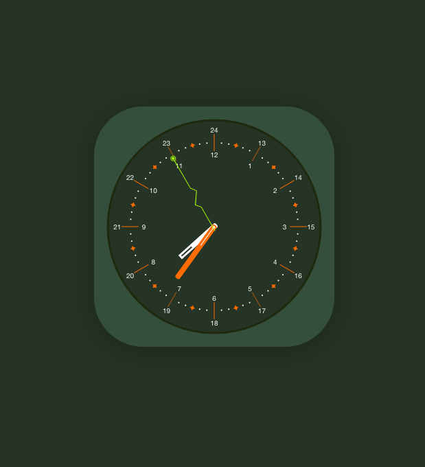

# 2F - 時鐘

20191017

[UI設計稿](https://xd.adobe.com/spec/43be2f02-1d11-4dfb-4e3d-5c4df1df3896-358f/screen/e7b79d5d-37bb-41f7-8ca2-9df3811589e9/003-clock/)

---

排起來的結果如下



以下紀錄幾個note    

## create-react-app 引入SVG 

我是在[這裡](https://create-react-app.dev/docs/adding-images-fonts-and-files/)找到方法的    

```tsx
import React from 'react';
import { ReactComponent as ClockSvg } from './assets/clock-bg.svg';

const Clock: React.FC = () => {
  return (
    <div>
      <ClockSvg />
    </div>
  );
}

export default Clock;

```

## 指針位置歸零

時針分針秒針，主要是需要靠retate旋轉角度來呈現時間     
而我用的是UI設計稿，圖片是在三點三十秒，所以時針(3點)和秒針(30秒)一開始都不是在0點的位置       
要扣掉角度回到初始值(00點00分00秒)，比較好做rotate    


>   時鐘共360度    
  12小時會走完一圈，所以360/12=30，一小時是30度    
  60分會走完一圈，所以360/60=6，一分是6度    
  60秒會走完一圈，所以360/60=6，一秒是6度    
  我們拿到的svg圖片起始角度，小時是在三點，所以要再扣3*30=90度    
  我們拿到的svg圖片起始角度，秒是在6點，所以要再扣6*30=90度    


## transform-origin

時針分針秒針轉動的時候，要設定好transform-origin，不然初始值是在圖片中心，rotate起來就是在原地打轉       
而我們怎麼知道`transform-origin`在哪裡呢？     
這邊我用after做一個小點點，方便我觀察位置    

```scss
&:after {
  position: absolute;
  left: ${transformOriginX};
  top: ${transformOriginY};
  width: 5px;
  height: 5px;
  content: '';
  background-color: ${backgroundColor};
  border-radius: 50%;
  transform: translate(-50%, -50%);
}
```     


## 每秒變換一次     

**基本版**     

```ts
useEffect(() => {
  const interval = setInterval(() => setDate(new Date()), 1000);
  return () => clearInterval(interval);
}, []);
```


**rxjs版**        
       
```ts
useEffect(() => {
  const tick = () => setDate(new Date());
  const clock$ = interval(1000).subscribe(tick);
  return () => clock$.unsubscribe();
}, []);
```

**requestAnimationFrame版**    

```ts
function loop(){
  setDate(new Date());
  requestAnimationFrame(loop);
}

useEffect(() => {
  requestAnimationFrame(loop)
}, []);
```

## 測試      
我會用兩種方法測        
### 1. new Date()
用`new Date()`套上我想要的時間，看看還有哪裡需要調整  
比如2019/10/16 3點40分40秒    

```ts
// 年 月 日 時 分 秒
new Date(2019,10,16,3,40,40)
```

### 2. 測試轉一圈    

指針位置和旋轉點調完，如果在那裡等時間一分一秒過去，會很久      
簡單做個hover就轉一圈，來看看還有哪裡需要調整         

```scss

&:hover {
  .hour-hand {
    transform: rotate(360deg);
    transition: all 3s;
  }

  .minute-hand {
    transform: rotate(360deg);
    transition: all 0.5s;
  }

  .second-hand {
    transform: rotate(360deg);
    transition: all 0.5s;
  }
} 
```
