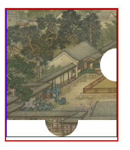
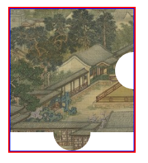
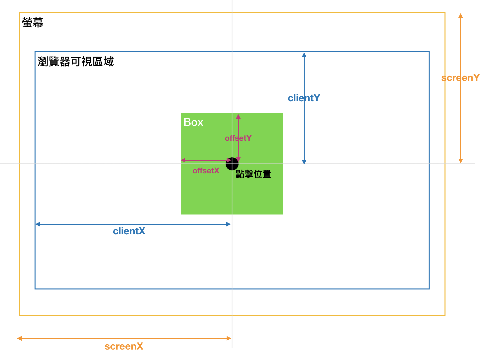
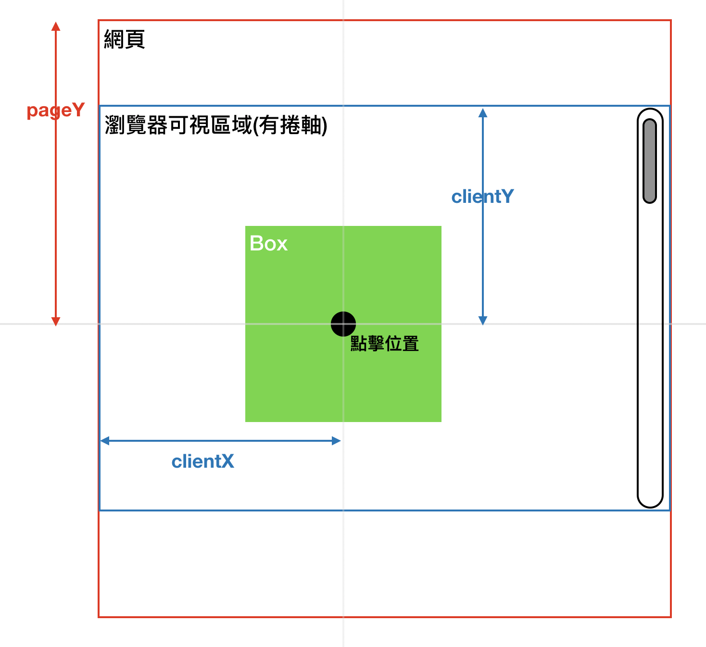
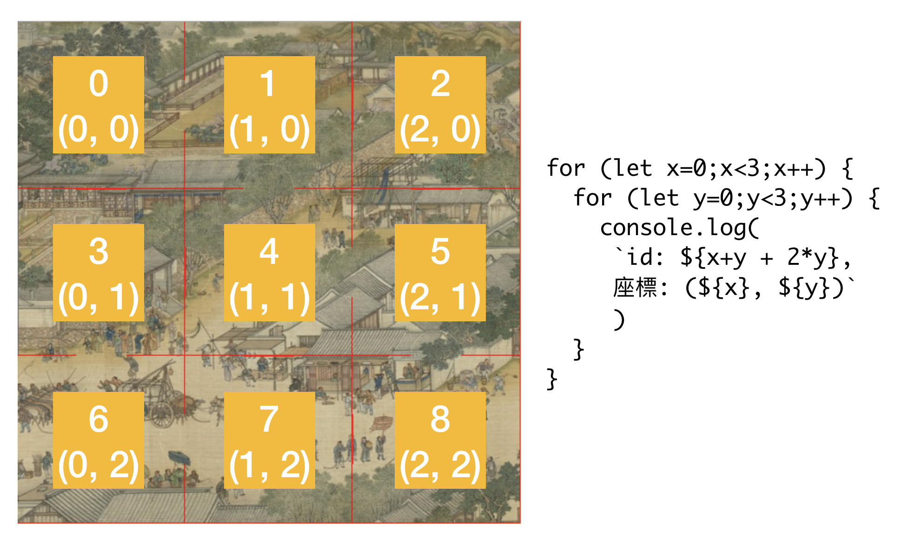

# 12F - 拼圖

20191021

[UI設計稿](https://xd.adobe.com/spec/b394d8de-9cbe-4be0-7d31-4742953d0a65-c5a5/screen/ced05f54-2619-4da9-b107-7f25ad6e0a87/reference/)

---


## img加上 vertical-align: middle 消除父層div空白    
這個是在amos的[金魚系列](https://ithelp.ithome.com.tw/articles/10216684)學到的    
直接看差異       
可以看到裡面圖片的border是藍色，外面的border是紅色          
明明已經使用`fit-content`，下方卻還是多了空白      

```html
<div class="piece">
  
</div>
```

```scss
.piece {
  width: fit-content;
  height: fit-content;
}
```

 


這時我們可以給img加上 vertical-align: middle       
```scss
.piece {
  width: fit-content;
  height: fit-content;
  > img {
    vertical-align: middle;
  }
}
``` 
效果如下，空白消失          

 


## clientX, pageX, offsetX

這題需要了解clientX, offsetX, clientY, offsetY這些觀念     
我整理了兩張圖來了解        
 
 

## 拼圖座標

因為要算碰撞的位置，所以我把拼圖的座標分配如下    

 
