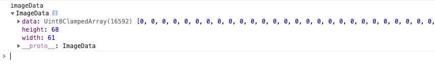
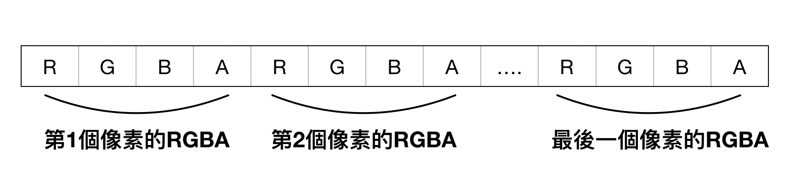
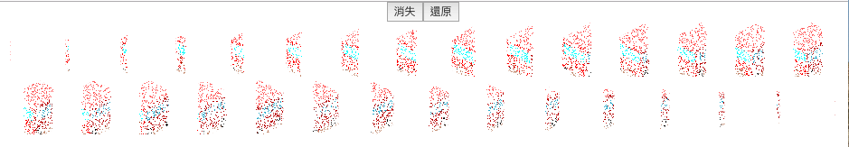
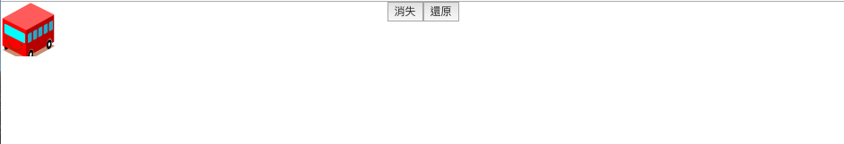
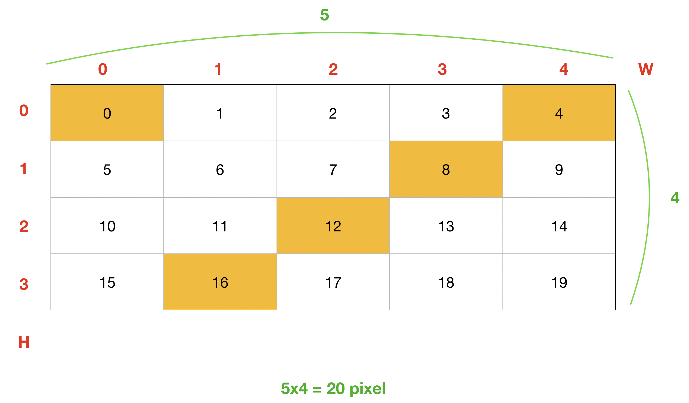
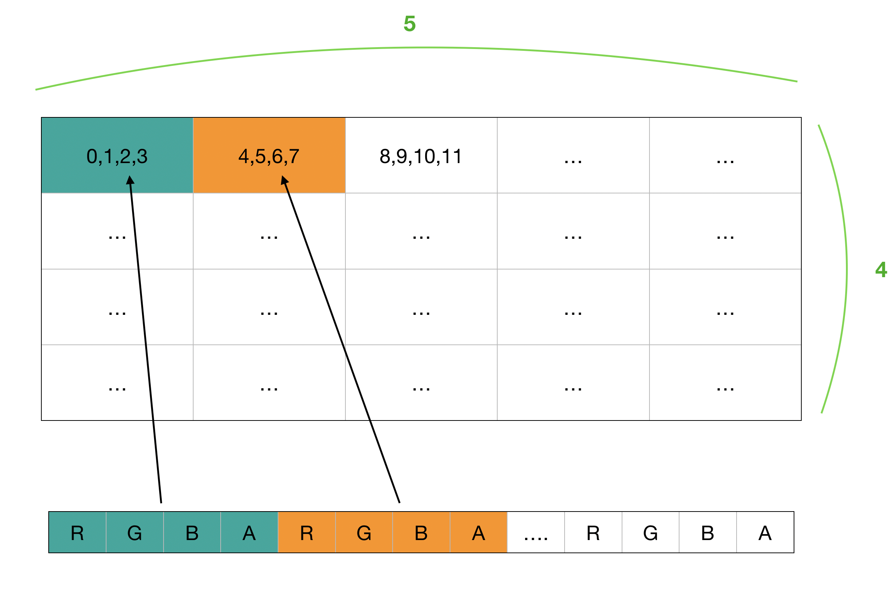
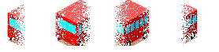
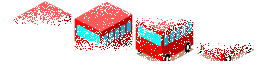
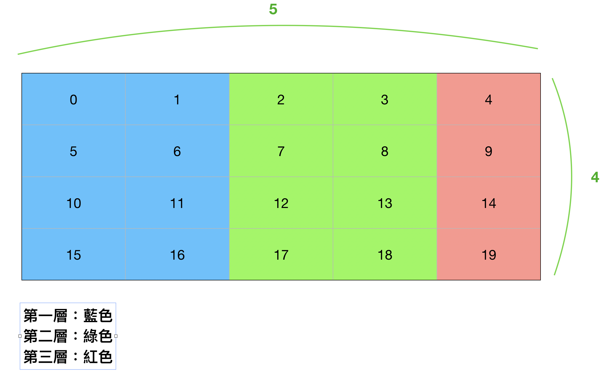

# 15F - 15F-死亡筆記本-Thanos(薩諾斯)效果

20191007


[UI設計稿](https://xd.adobe.com/spec/ab354ac3-8cd5-4956-6b2a-236f45b381ca-dd04/)

參考：    
[來寫個無限手套的分解特效吧](https://medium.com/chris-chuang/%E4%BE%86%E5%AF%AB%E5%80%8B%E7%84%A1%E9%99%90%E6%89%8B%E5%A5%97%E7%9A%84%E5%88%86%E8%A7%A3%E7%89%B9%E6%95%88%E5%90%A7-908d80792d85)    
[ngx-thanos](https://github.com/wellwind/ngx-thanos/blob/a993907c25d4983dbeeccc3eb539e02923c1623d/libs/thanos-snap/src/lib/thanos-snap.ts)    
[Thanos Snap Effect JavaScript Tutorial](https://redstapler.co/thanos-snap-effect-javascript-tutorial/)    
[打造高大上的Canvas粒子动画](https://juejin.im/entry/57baf747a34131005b130069)   
[11.3: The Pixel Array - p5.js Tutorial](https://www.youtube.com/watch?v=nMUMZ5YRxHI) 

---
   

花了幾天參考很多文章後終於看出了一點頭緒。     
首先我們先看畫面的部分，主要就是一張網路上找的小圖片，跟兩個按鈕來驅動消失和還原的效果            

#### 畫面
```jsx
<div className="wrapper" ref={wrapperEl}>
  
  <div className="container">
    <button className="start" onClick={handleClick}>消失</button>
    <button className="start" onClick={handleRestore}>還原</button>
  </div>
</div>
```

再來，程式的部分主要分成四個步驟    

1. 先把圖片畫到canvas上面
2. 取得這張圖片的像素資料。因為canvas有getImageData()可以取得ImageData Instance，我們可以拿到rgba的像素資料
3. 做消失的效果。方法是把一張圖片分到n層去
4. 把上一步做出來的層畫回到canvas上面，並綁上動畫的特效，等之後按下按鈕觸發效果    

我們先看一下程式碼，等下再一個個的講解


#### 程式主要邏輯

```ts
const wrapper: HTMLElement = wrapperEl.current;
const img: HTMLImageElement = imgEl.current;
const canvas: HTMLCanvasElement = document.createElement('canvas');
const ctx: CanvasRenderingContext2D = canvas.getContext('2d')!;
let imgWidth = img.width;
let imgHeight = img.height;
// canvas要跟圖片一樣大
canvas.width = imgWidth;
canvas.height = imgHeight;
// 要分幾層。每層分配不同的像素來達到粒子化的效果
const layerCount = 30;

// 1.把圖片畫到canvas上
ctx.drawImage(img, 0, 0, imgWidth, imgHeight);

// 2.再透過getImageData取得ImageData Instance
const imageData = ctx.getImageData(0, 0, imgWidth, imgHeight);

// 3. 把一張圖片分到n層去，隨機的取樣，做粒子化
let samplerLayersList = Utils.sampler(imageData, imgWidth, imgHeight, layerCount)

// 4. 把粒子化的特效畫到canvas上
const updatedCanvasList = Utils.appendLayersWithParticleEffect(samplerLayersList, imgWidth, imgHeight, wrapper);
setCanvasList(updatedCanvasList);
```

## 步驟拆解

### 1.把圖片畫到canvas上
這一步主要就是把圖片畫到canvas上，因為我們要用canvas來做特效      
canvas的畫布大小就跟原本圖片一樣大就好    

```ts
// 1.把圖片畫到canvas上
ctx.drawImage(img, 0, 0, imgWidth, imgHeight);
```

### 2. 透過getImageData取得ImageData Instance

這一步我們想要做的就是取得每個像素

canvas有個getImageData()的方法，可以讓我們取得像素資料    

```ts
// 2.再透過getImageData取得ImageData Instance
const imageData = ctx.getImageData(0, 0, imgWidth, imgHeight);
```

如果我們把imageData印出來，會看到ImageData有個data屬性，是Unit8ClampedArray類型    



Unit8ClampedArray是一個一維的陣列，會存放存放每個像素的信息    
像素是用RGBA表示，每個都是介於0~255之間的值，就可以表示一個顏色    
所以每四個一組，循環下去，就可以表示出一整張圖      



```js
// R - 紅色 (0-255)  G - 綠色 (0-255) B - 藍色 (0-255) A - alpha 通道 (0-255)
red=imgData.data[0];
green=imgData.data[1];
blue=imgData.data[2];
alpha=imgData.data[3];
```

可以看到我上面的例子，ImageData的長寬是`61*68=4148px`，`4148*4`就可以得到`Unit8ClampedArray`的長度是`16592`    


### 3. 隨機的取樣，做粒子化，讓一些像素消失    

這裡我們要開始做粒子化，原理是用很多層，每一層分配不同的像素，最後加上一些動畫特效，就會很像薩若斯的效果    


```ts
// 3. 把一張圖片分到n層去，隨機的取樣，做粒子化
let samplerLayersList = Utils.sampler(imageData, imgWidth, imgHeight, layerCount)
```

`sampler()`程式如下
```ts
export function sampler(sourceImgData: ImageData, canvasWidth: number, canvasHeight: number, layerCount: number) {
  // 創造n個空白的ImageData Instance陣列
  const emptyLayersList: Array<ImageData> = initLayersList(layerCount, canvasWidth, canvasHeight);
  
  // 把抽到的index補上像素
  let newImgDatas = R.clone(emptyLayersList);
  for (let x = 0; x < canvasWidth; x++) {
    for (let y = 0; y < canvasHeight; y++) {
      for (let l = 0; l < 2; l++) {
        // 把原本的圖片分散到n層
        // x方向的分散到n層
        const layerIndex = Math.floor(layerCount * (Math.random() + 2 * x / canvasWidth) / 3);
        // y方向的分散到n層
        // const layerIndex = Math.floor(layerCount * (Math.random() + 2 * y / canvasHeight) / 3);
        
        // 取得像素R的位子
        const pixelPos = 4 * (x + y * canvasWidth);
        // 找到R就找到R,G,B,A
        for (let rgbaIndex = 0; rgbaIndex < 4; rgbaIndex++) {
          const dataPos = pixelPos + rgbaIndex;
          newImgDatas[layerIndex].data[dataPos] = sourceImgData.data[dataPos];
        }
      }
    }
  }
  return newImgDatas;
}
```


以下是我們用30層做出來的感覺



如果再調一下css，讓canvas都疊在一起，就會是原本的圖片

```scss
canvas {	
	position: absolute;
	top: 0;
  left: 0;
}
```




### sampler()在做什麼    

現在我們再仔細看`sampler()`有做幾件事     

#### 1. 建立空的ImageData

首先我們需要建立空的ImageData出來，前面有說過 ImageData有存像素資訊，可以表現出一張完整的圖，    
我們需要做出30張空的ImageData，等下可以跟原圖對照後，塞想要的像素進來。     

```ts
function initLayersList(layerCount: number, width: number, height: number) {
  const canvas: HTMLCanvasElement = document.createElement('canvas');
  const ctx: CanvasRenderingContext2D = canvas.getContext('2d')!;
  return R.range(0, layerCount).map(() => {
    return ctx.createImageData(width, height)
  })
}
```

```ts
  // 創造n個空白的ImageData Instance陣列
  const emptyLayersList: Array<ImageData> = initLayersList(layerCount, canvasWidth, canvasHeight);
```


可以使用createImageData()方法創造一個全新空白的ImageData 物件。


看完這個[例子](https://www.w3school.com.cn/html5/canvas_createimagedata.asp)，我就懂createImageData()要幹嘛了

```js
var c=document.getElementById("myCanvas");
var ctx=c.getContext("2d");
// 建立一個100*100的ImageData Instance
var imgData=ctx.createImageData(100,100);
// 像素資料是rgba，所以每四個為一組
for (var i=0;i<imgData.data.length;i+=4) {
  // 做出綠色
  imgData.data[i+0]=255;
  imgData.data[i+1]=0;
  imgData.data[i+2]=0;
  imgData.data[i+3]=255;
}
// 畫回canvas
ctx.putImageData(imgData,10,10);
```

參考 https://developer.mozilla.org/zh-TW/docs/Web/API/Canvas_API/Tutorial/Pixel_manipulation_with_canvas


#### 2. 取得像素的位置      

我們要知道像素的位置，分給n層       
   

假設我們有一個`5*4=20px`的圖片       
上面有提到RGBA是四個一組，所以在`Uint8ClampedArray`的長度會是`80(20*4)`     

我們只要關注R的位置就可以拿到每個像素的頭，就可以知道這個像素的R,G,B,A    



R的位置我用橘色的框起來，上面的數字就是index，我們可以推出一個公式    

> x + y * width    

```js
for (let x = 0; x < w; x++) {
  for (let y = 0; y < h; y++) {
    let index = x + y * w;
    console.log(`(${x},${y}), index is ${index}`);
  }
}
```

然後因為RGBA是四個一組，所以要再乘以4    
所以code裡面會看到`const pixelPos = 4 * (x + y * canvasWidth);`    


> (x + y * width) * 4      


所以實際上的index會是這樣     
    

#### 3. 決定方向     


這裡是把一張圖片，分散成n層。所以n層合起來就是一張完整的圖片。    
layerIndex會根據機率決定要分到哪一層。       
比如30層的話，layerIndex就會得到0~29之間的數字        

```ts
// 把原本的圖片分散到n層
// x方向的分散到n層
const layerIndex = Math.floor(layerCount * (Math.random() + 2 * x / canvasWidth) / 3);
// y方向的分散到n層
const layerIndex = Math.floor(layerCount * (Math.random() + 2 * y / canvasHeight) / 3);     
```


30層太多，我用4層來示意，會比較簡化    

水平方向分四層      
     
垂直方向分四層      
      

`layerIndex`的算法看起來太複雜，我們先把`Math.random()`拿掉，直接用1來算，比較簡單，這時layerIndex就會介於1~3之間    
`const layerIndex = Math.floor(layerCount * (1 + 2 * x / canvasWidth) / 3);`    
畫面看起來會像這樣，就只有三層         


我們已經知道怎麼把圖片分層了     
但是為什麼看起來很像是水平方向切三塊呢？這是layerIndex和pixelPos搭配起來的效果    

我們用簡單一點的`5*4`來看，不要有`Math.random()`，然後先看RGBA的R的位置就好      
  
我做了一個簡單的程式    
```ts
let w = 5
let h = 4
layerCount = 4

for (let x = 0; x < w; x++) {
  for (let y = 0; y < h; y++) {
    const layerIndex = Math.floor(layerCount * (1 + 2 * x / w) / 3);  
    // 先不要乘以4  
    const pixelPos = (x + y * w);
    console.log(`把這個pixel: ${pixelPos} 畫在這一層：${layerIndex}`)
  }
}
```

這時console的結果是
```
"把這個pixel: 0 畫在這一層：1"
"把這個pixel: 5 畫在這一層：1"
"把這個pixel: 10 畫在這一層：1"
"把這個pixel: 15 畫在這一層：1"
"把這個pixel: 1 畫在這一層：1"
"把這個pixel: 6 畫在這一層：1"
"把這個pixel: 11 畫在這一層：1"
"把這個pixel: 16 畫在這一層：1"
"把這個pixel: 2 畫在這一層：2"
"把這個pixel: 7 畫在這一層：2"
"把這個pixel: 12 畫在這一層：2"
"把這個pixel: 17 畫在這一層：2"
"把這個pixel: 3 畫在這一層：2"
"把這個pixel: 8 畫在這一層：2"
"把這個pixel: 13 畫在這一層：2"
"把這個pixel: 18 畫在這一層：2"
"把這個pixel: 4 畫在這一層：3"
"把這個pixel: 9 畫在這一層：3"
"把這個pixel: 14 畫在這一層：3"
"把這個pixel: 19 畫在這一層：3"
```

我們直接對應到圖上，看起來就是這樣：

     
看起來就是水平方向分了三層     

這就是粒子化的主要邏輯了        


#### 4. repeat    
code裡面有一段 `for (let l = 0; l < 2; l++) {}` ，為什麼要再多一層`l`的for迴圈呢?    
我試著把數字調成20看看，就知道他就是加強的感覺，重複上色      

`for (let l = 0; l < 20; l++) {}`看起來如下    
  


---


### 4. 把粒子化的特效畫到canvas上
```ts
const updatedCanvasList = Utils.appendLayersWithParticleEffect(samplerLayersList, imgWidth, imgHeight, wrapper);
```

這一步主要的重點就是加上transition，然後再畫回去canvas上
```ts
    layerCanvasEl.style.transition = `transform 1.2s ease-out, opacity 1.5s ease-out`;
    chuckCtx.putImageData(layerImageData, 0, 0);
```

## 觸發Thanos    
加上transform的效果，然後把opacity改成0    
搭配上面設定的transition看起來就很像了    

這個動畫效果我是用[ngx-thanos](https://github.com/wellwind/ngx-thanos/blob/a993907c25d4983dbeeccc3eb539e02923c1623d/libs/thanos-snap/src/lib/thanos-snap.ts)的


```ts
    canvasList.forEach((c: HTMLCanvasElement, index: number) => {
      setTimeout(() => {
        const rotate1 = 15 * (Math.random() - 0.5);
        const rotate2 = 15 * (Math.random() - 0.5);
        const fac = 2 * Math.PI * (Math.random() - 0.5);
        const translateX = 60 * Math.cos(fac);
        const translateY = 30 * Math.sin(fac);

        c.style.transform = `rotate(${rotate1}deg) translate(${translateX}px, ${translateY}px) rotate(${rotate2}deg)`;
        c.style.opacity = '0';
        const removeDelay = 1e3 * (1.5 + 1 + Math.random());
        setTimeout(() => c.remove(), removeDelay);
      }, 70 * index);
    });
```

---


## # 要把圖片畫到canvas，高度一直是0

圖片的css是根據parent div的寬高來調整，當圖片沒有加載完成的時候，拿到的高度一直都是0    
```scss
    img {
      width: 100%;
      height: auto;
    }
```

加了onload後，就可以順利取得高度了     

```jsx
  useEffect(() => {
    if (!imgEl.current) {
      console.error("沒有imgEl")
      return;
    }
    if (!canvasEl.current) {
      console.error("沒有canvasEl")
      return;
    }
    const img: HTMLImageElement = imgEl.current;
    const canvas: HTMLCanvasElement = canvasEl.current;
    const ctx: CanvasRenderingContext2D = canvas.getContext('2d')!;
    console.log("圖片還沒加載完成",img.getBoundingClientRect())
    // 要等到圖片加載完成再畫到canvas上
    img.onload = (() => {
      console.log("圖片加載完成，可以拿到寬高",img.getBoundingClientRect())
      // 設定canvas和image一樣大
      canvas.width = img.width;
      canvas.height = img.height;
      // 在canvas上面把圖片畫上去
      ctx.drawImage(img, 0, 0, img.width, img.height);
    })
  });
```


參考：[圖片到底載入了沒？](http://otischou.tw/notes/2017/01/01/detect-is-image-loaded.html)
